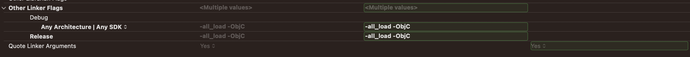

# Benchmark
Tools for benchmarking alternatives to cloud anchors

# Install Protobuf
We use protobuf for serializing data. You can install swift-protobuf (https://github.com/apple/swift-protobuf#alternatively-install-via-homebrew) from brew: 
```
brew install swift-protobuf
```

# Install OpenCV Swift
We use a custom build of opencv. The reason for this is that there is a class called ```VideoWriter``` that conflicts with some of the built in default symbols from Apple. Since we don't actually use that swift module, we build an opencv version without that module. 

The build script is contained in here: https://github.com/occamLab/benchmark/blob/main/.github/workflows/opencv-build.yaml. Unzip the build artifact from https://github.com/occamLab/benchmark/releases/tag/1 and drag the folder ```opencv2.framework``` into ```ios_logger2``` from the root of the repo. 

# Protobuf Instructions
First you need to compile the protobuf files: 
```
cd ios_logger2
protoc --swift_opt=FileNaming=DropPath --swift_out=protos/codegen protos/*.proto
```
Then to get swift to recognize them: 
  1) Right click on the "protos" folder 
  2) Press "Add files to ios_logger2" 
  3) Select the generated files (or the whole folder)

# Swift Dependencies 
1) https://github.com/tsolomko/SWCompression (used in UploadManager.swift)
2) https://github.com/firebase/firebase-ios-sdk (used to upload data to firebase)
3) https://github.com/apple/swift-protobuf (used to encode swift types to binary) 
4) https://github.com/google-ar/arcore-ios-sdk (ArCore for CloudAnchors)
5) https://github.com/opencv/opencv (we manually build the swift wrappers for opencv ourselves see above)

# Note linker flags
1) Linker flag ```-ObjC``` must be turned on as per https://github.com/google-ar/arcore-ios-sdk/tree/master#installation
2) Linker flag ```-all_load``` must be turned on as per https://github.com/opencv/opencv/issues/17532
3) Otherwise you will get the most cryptic crash message that will waste way too much of your time. The error will be along the lines of: 
```swift
2023-06-12 15:25:58.395537-0400 ios_logger2[24686:2190906] +[GARDeviceProfile profileForIdentifier:osVersion:configurationManager:]: unrecognized selector sent to class 0x104ecf820
2023-06-12 15:25:58.396973-0400 ios_logger2[24686:2190906] *** Terminating app due to uncaught exception 'NSInvalidArgumentException', reason: '+[GARDeviceProfile profileForIdentifier:osVersion:configurationManager:]: unrecognized selector sent to class 0x104ecf820'
```

<p align="center">
  
  The linker flags in Xcode can be updated like so
</p>
